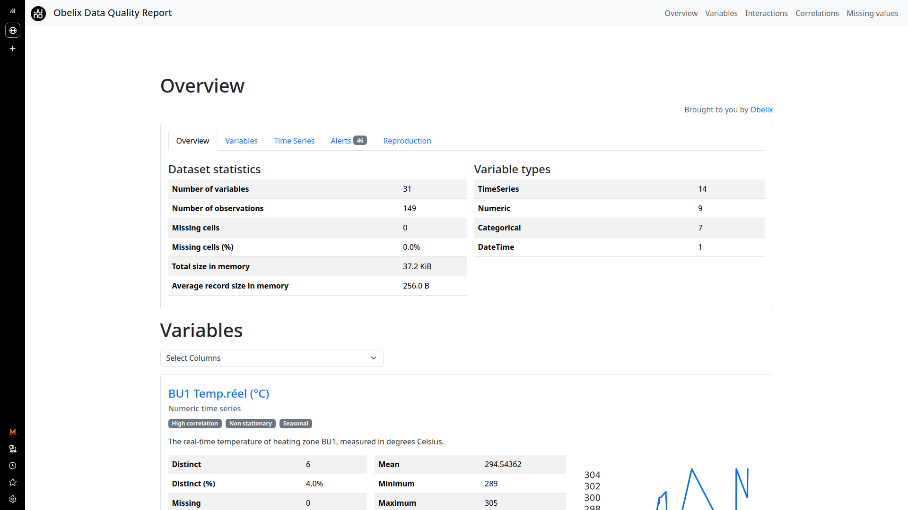
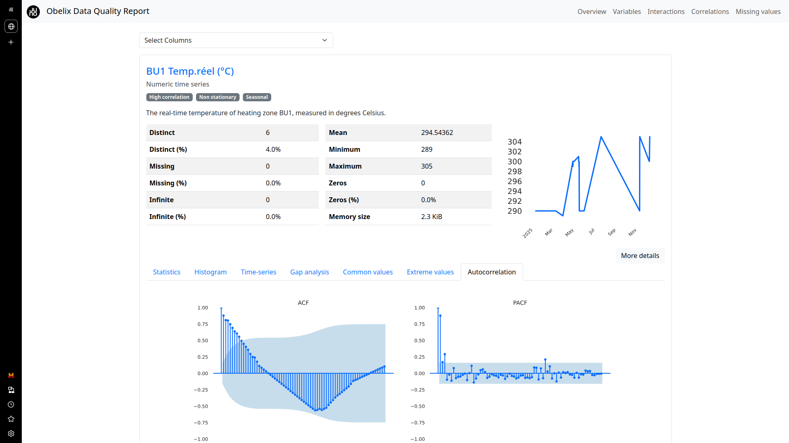

# Obelix
Agentic EDA tool with automated, interactive visual reports, detailed statistics, data type inference, missing value analysis, correlation matrices, time-series and text analysis, file and image metadata examination.

---
## Calculated metrics

- Data types inference (categorical, numerical, date, etc.)
- Missing values count and percentage per column
- Descriptive statistics (mean, median, mode, min, max, standard deviation, variance)
- Quantiles (25%, 50%, 75%)
- Unique values count and frequency
- Histograms and distribution visualizations
- Correlation matrices (Pearson, Spearman, Kendall)
- Highly correlated features alerts
- Skewness and kurtosis of numerical data
- Identification of constant and quasi-constant features
- Sample data preview
- Memory usage for dataset and individual columns
- Duplicate rows count
- Warnings and alerts for possible data quality issues (e.g., high missingness, duplicated rows)
- Interaction matrices and pairwise variables scatter plots
- Missing data patterns and heatmaps
- Time-series specific stats (auto-correlation, seasonality detection)
- Text data analysis (common categories, unique tokens, script detection)
- File/image metadata (file sizes, creation/modification dates, dimensions)
  
---
## Screenshots
 
 
 
